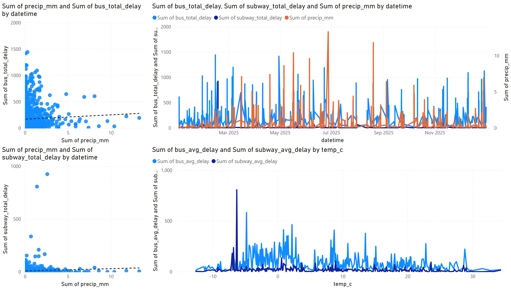

# Toronto Transit & Weather Resilience Pipeline

### **End-to-End Data Engineering via Medallion Architecture in Microsoft Fabric**

This project analyzes the impact of weather (precipitation and temperature) on Toronto Transit Commission (TTC) service efficiency. By automating the ingestion of transit and meteorological data, the pipeline quantifies how urban mobility is affected by environmental conditions.

## Architecture: The Medallion Pattern
The project implements a **Medallion Architecture** to ensure data quality and lineage as it moves from raw API calls to analytical insights.

* **Bronze (Raw):** Ingests raw JSON (Weather) and CSV (TTC) data via Python `requests` directly into the Lakehouse `Files` section.
* **Silver (Cleaned):** PySpark processing to enforce schemas, standardize column names, and flatten nested JSON structures using `arrays_zip` and `explode`.
* **Gold (Curated):** Hourly aggregations and a complex outer-join between Bus, Subway, and Weather datasets. Uses `F.coalesce` to maintain a unified temporal index.

## Dashboard Preview
Below is the final Power BI dashboard generated by the pipeline. It highlights the hourly correlation between precipitation levels and transit delays across 2025.

### **Key Insights Visualized:**
* **Weather-Induced Delay Patterns:** The scatter plots (left) confirm a positive correlation trend; as precipitation (mm) increases, total delay minutes trend upward for both TTC transit.
* **The Stability Gap:** The line graph (top right) highlights that **Subway delays remain significantly lower and more stable** regardless of weather. In contrast, Bus delays are far more volatile and spike dramatically during adverse weather events.
* **Freezing Point Vulnerability:** The thermal analysis (bottom right) shows that delays are **relatively higher, specifically around 0°C**, likely due to ice, slush, and other freeze–thaw effects that disrupt operations.

## Tech Stack & Techniques
* **Orchestration:** **Fabric Data Factory Pipelines** for automated sequential notebook execution.
* **Data Processing:** **PySpark (Spark SQL)** for scalable ETL and complex data transformations.
* **Storage:** **Delta Lake** tables for ACID-compliant storage and schema evolution.
* **Analytics:** **Power BI (Direct Lake)** for real-time visualization of Delta tables without data movement.
* **Data Sources:** [City of Toronto Open Data](https://open.toronto.ca/) & [Open-Meteo API](https://open-meteo.com/).

## Deployment & Usage

### **Prerequisites**
* An active **Microsoft Fabric** workspace.

### **Execution Steps**
1.  **Sync to Fabric:** Use the **Source Control** feature in your Fabric Workspace to connect and sync this GitHub repository.
2.  **Run the Pipeline:** Locate the **`pipeline`** item in your workspace and click **Run**. 
    * *The pipeline automatically orchestrates the execution of: `Fetch_Data` → `Silver_Process` → `Aggregate_Hourly` → `Gold_Process`.*
3.  **Visualize:** Once the pipeline completes, open the `TTC_Weather_Report` to explore the interactive dashboard.

---
*Developed as a demonstration of modern Data Engineering practices in Microsoft Fabric.*
